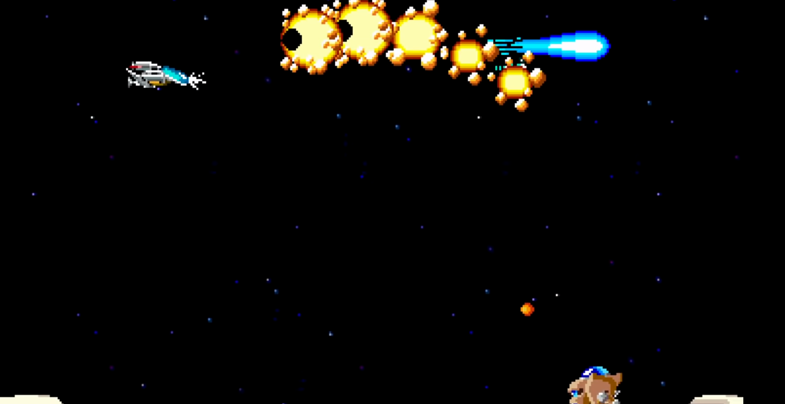

# R-TYPE - RULES and GAME

## Game:

R-Type is a classic side-scrolling shoot 'em up (shmup) video game that was first released in the arcades by Irem in 1987. 
 
It has since become an iconic and influential title in the shoot 'em up genre. 
 
The game is known for its challenging gameplay, unique power-up system, and distinctive visual style.

 
 

### Side Scrolling Gameplay

R-Type is played on a 2D side-scrolling plane. 
 
Your spaceship, known as the R-9, moves from left to right through a series of horizontally scrolling levels, facing a variety of enemy spacecraft, obstacles, and boss battles.

 

### Objective

The main objective of R-Type is to progress through the game's levels, defeating waves of enemies and ultimately facing and defeating the powerful end-of-level bosses. 
 
Your goal is to complete all the levels and save the universe from the Bydo, an alien race that threatens Earth.

 

### Life system

In R-Type, you have a limited number of lives, and when you lose all of them, you'll need to restart at the beginning of the level.

 

### Highscore

As with many classic arcade games, R-Type encourages players to compete for high scores. 
 
Scoring is based on destroying enemies.

 

### Atmosphere and Aestheics

R-Type is known for its dark and atmospheric sci-fi setting. 
 
The game's graphics, music, and sound effects create an immersive experience.

 

### Weapons

Your starship has two primary weapons: 
- A blaster that can shoot lots of bullets but inflict small damages.
- A canon that shoot very slowly but inflict a lot of damages

 

 
 
 
 

# R-TYPE - RÈGLES ET JEU

## Jeu :

R-Type est un jeu vidéo classique de type shoot 'em up à défilement latéral (shmup) qui a été initialement publié dans les salles d'arcade par Irem en 1987. 
 
Il est depuis devenu un titre emblématique et influent dans le genre du shoot 'em up. 
 
Le jeu est connu pour son gameplay exigeant, son système de power-up unique et son style visuel distinctif.

 

 

## Jouabilité à Défilement Latéral

R-Type se déroule sur un plan en 2D à défilement latéral. Votre vaisseau spatial, connu sous le nom de R-9, se déplace de gauche à droite à travers une série de niveaux à défilement horizontal, affrontant une variété de vaisseaux ennemis, d'obstacles et de combats de boss.

 

## Objectif

L'objectif principal de R-Type est de progresser à travers les niveaux du jeu, en éliminant des vagues d'ennemis et en affrontant finalement les puissants boss de fin de niveau. 
 
Votre but est de compléter tous les niveaux et de sauver l'univers de l'invasion des Bydo, une race extraterrestre menaçant la Terre.

 

## Système de Vies

Dans R-Type, vous disposez d'un nombre limité de vies. 
 
Lorsque vous les avez toutes perdues, vous devrez recommencer depuis le début du niveau.

 

## Score Élevé

Comme de nombreux jeux d'arcade classiques, R-Type encourage les joueurs à concourir pour obtenir un score élevé. 
 
Le score est basé sur la destruction des ennemis.

 

## Atmosphère et Esthétique

R-Type est reconnu pour son ambiance sombre et son cadre de science-fiction. 
 
Les graphismes, la musique et les effets sonores du jeu créent une expérience immersive.

 

## Armes

Votre vaisseau spatial dispose de deux armes principales :
- Un blaster qui peut tirer de nombreuses balles mais inflige des dégâts faibles.
- Un canon qui tire très lentement mais inflige de lourds dégâts.

 

 
