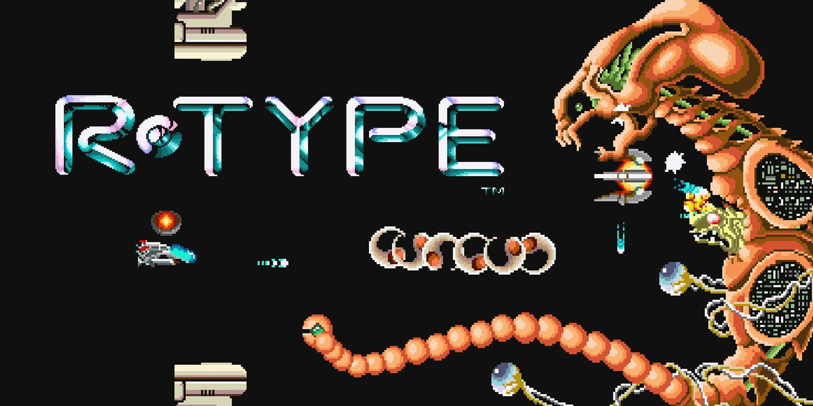

# R-TYPE - RULES and GAME

## __Game__:

R-Type is a classic side-scrolling shoot 'em up (shmup) video game that was first released in the arcades by Irem in 1987. 
 
It has since become an iconic and influential title in the shoot 'em up genre. 
 
The game is known for its challenging gameplay, unique power-up system, and distinctive visual style.

 

 

### __Side Scrolling Gameplay__

R-Type is played on a 2D side-scrolling plane. 
 
Your spaceship, known as the R-9, moves from left to right through a series of horizontally scrolling levels, facing a variety of enemy spacecraft, obstacles, and boss battles.

 

### __Objective__

The main objective of R-Type is to progress through the game's levels, defeating waves of enemies and ultimately facing and defeating the powerful end-of-level bosses. 
 
Your goal is to complete all the levels and save the universe from the Bydo, an alien race that threatens Earth.

 

### __Life system__

In R-Type, you have a limited number of lives, and when you lose all of them, you'll need to restart at the beginning of the level.

 

### __Highscore__

As with many classic arcade games, R-Type encourages players to compete for high scores. 
 
Scoring is based on destroying enemies.

 

### __Atmosphere and Aestheics__

R-Type is known for its dark and atmospheric sci-fi setting. 
 
The game's graphics, music, and sound effects create an immersive experience.

 

### __Weapons__

Your starship has two primary weapons: 
- A blaster that can shoot lots of bullets but inflict small damages.
- A canon that shoot very slowly but inflict a lot of damages

 
