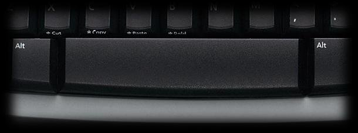

# How to play

## English

### controls

#### movements

In order to move your spaceship you must use your arrows keys on your keyboard.
 
You can go up, down, left and right

 

 

#### fight

To defend yourself you can of course dodge ennemy's bullets.
 
In order to shoot you should press space bar.
 
/!\ it has two modes:
- single press shoot a simple bullet
- if you maintain pressed shoot power will increase
- if you shoot power is at its max, bullet will go though ennemies

 

