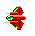
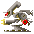
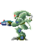
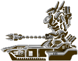
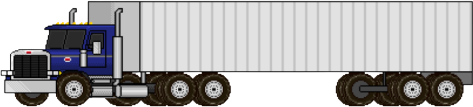
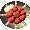
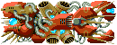

# Ennemies Documentation

## PLAYER DOCUMENTATION

## Ennemi 1
Il s'agit de l'ennemie de base.
 
Rapide et de petite taille il ne possède pas beaucoup de points de vie, il est donc facilement destructible.
 
Il ne raportte que 50 points.
 

 

## Ennemi 2
C'est un ennemi très rapide, mais avec peu de vie.
 
Il se déplace dans tous les sens
 
Il raporte 50 points lors de sa destruction.
 

 

## Ennemi 3
Cet ennemi est lent et assez gros.
 
Il est plutôt resistant mais peut être facilement détruit à l'aide d'un tir chargé.
 
Il raporte 200 points lors de sa destruction.
 

 

## Ennemi 4
C'est un ennemi très puissant avec beaucoup de vie.
 
Il sera difficile à détruire.
 
Cependant sa destruction rapporte pas moins de 500 points.
 

 

## Tank
Il s'agit d'un ennemi de type "Tank".
 
Rapide et de petite taille il ne possède pas beaucoup de points de vie, il est donc facilement destructible.
 
Il ne rapporte que 150 points.
 

 

## Sprinter
C'est un ennemi très rapide.
 
Il taversera votre écran sans prévenir.
 
Il rapporte 69 points lors de sa destruction mais il est déconseillé de vouloir le détruire.
 

 

## Worm Head
Cet ennemi est lent et assez gros.
 
Il est très résistant et très difficile à abattre.
 
Il rapporte 1000 points lors de sa destruction.
 

 

## Worm Body
C'est un ennemi très puissant avec beaucoup de vie.
 
Il sera difficile à détruire.
 
Cependant, sa destruction rapporte pas moins de 5000 points.
 

 

## Starship Boss
C'est le redoutable boss de l'espace.
 
Il est extrêmement puissant et représente un défi majeur.
 
La destruction du Starship Boss rapporte 5000 points.
 

 

